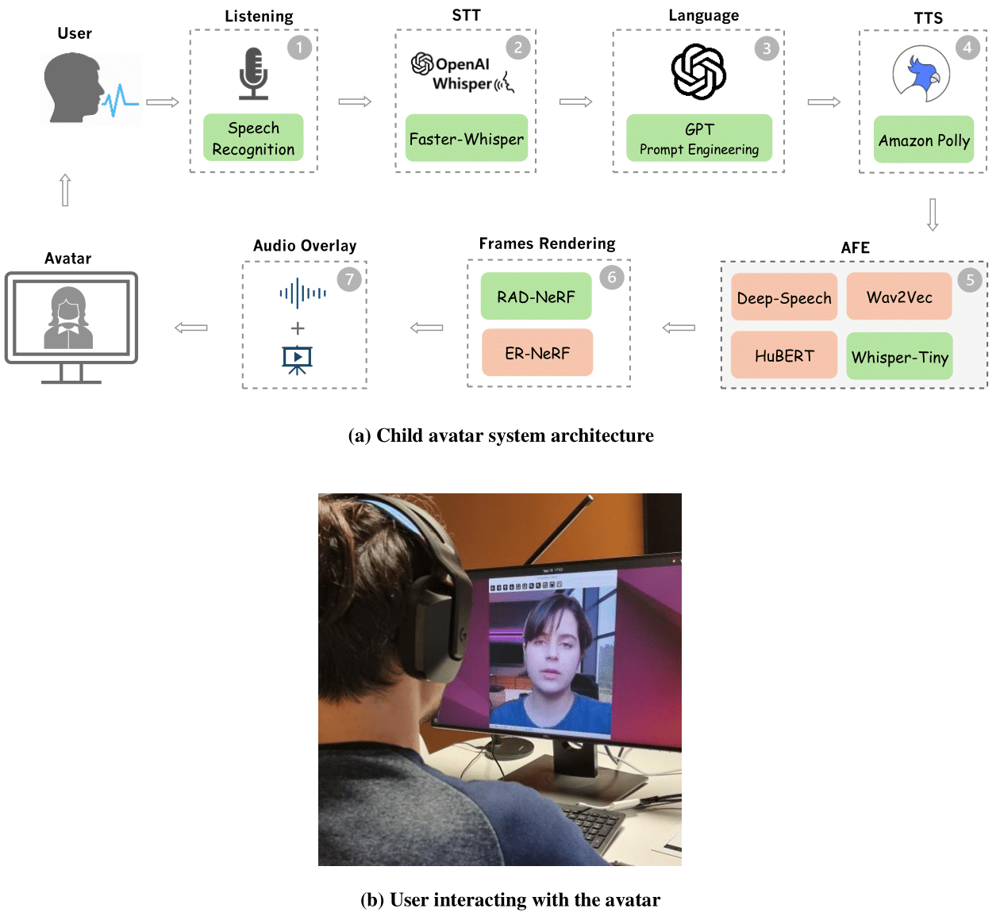

# Comparative Analysis of Audio Feature Extraction for Real-Time Talking Portrait Synthesis

[](https://arxiv.org/abs/2411.13209)





## Result based on RAD-NeRF

[](https://youtu.be/sBZWHk8y8-U)

## Result based on ER-NeRF

[](https://youtu.be/BqKS1KAfrhA)


## Audio Feature Extraction (AFE)

You should specify the type of audio feature when training and testing framework like: [ER-Nerf](https://github.com/Fictionarry/ER-NeRF) and [RAD-NeRF](https://github.com/ashawkey/RAD-NeRF)


### DeepSpeech

To extract features with DeepSpeech, use the following command:

```bash
python AFEs/deepspeech_features/extract_ds_features.py --input data/<name>.wav # save to data/
```

### HuBERT
To extract features with HuBERT, use the following command:
```bash

python AFEs/hubert.py --wav data/<name>.wav # save to data/<name>_hu.npy
```

### Wav2Vec
To extract features with Wav2Vec, use the following command:

```bash
python AFEs/wav2vec.py --wav data/<name>.wav --save_feats # save to data/<name>_eo.npy
```
### Whisper

To extract features with Whisper, use the following command:

```bash
python AFEs/whisper.py 
```


